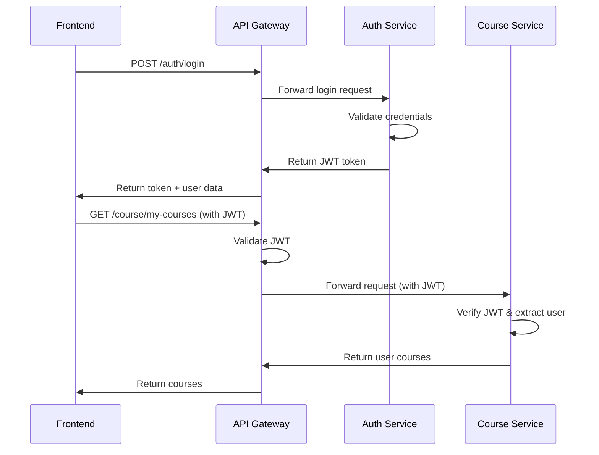

# Service Communication Patterns

This document outlines how the microservices communicate with each other and with the frontend in the StudyNotion platform.

## Architecture Overview

```
┌─────────────────┐    ┌─────────────────┐    ┌─────────────────┐
│   Frontend      │    │   API Gateway   │    │  Microservices  │
│   (React App)   │◄──►│   (Port 3000)   │◄──►│                 │
└─────────────────┘    └─────────────────┘    └─────────────────┘
                              │
                              ▼
                    ┌─────────────────┐
                    │   Load Balancer │
                    │   & Routing     │
                    └─────────────────┘
                              │
                    ┌─────────┴─────────┐
                    ▼                   ▼
            ┌───────────────┐   ┌───────────────┐
            │ Auth Service  │   │ Course Service│
            │ (Port 4001)   │   │ (Port 4002)   │
            └───────────────┘   └───────────────┘
                    ▼                   ▼
            ┌───────────────┐   ┌───────────────┐
            │Payment Service│   │ Other Services│
            │ (Port 4003)   │   │               │
            └───────────────┘   └───────────────┘
```

## Communication Patterns

### 1. Frontend to Backend Communication

**Route**: Frontend → API Gateway → Microservice

- **Protocol**: HTTP/HTTPS REST APIs
- **Base URL**: `http://localhost:3000/api/v1`
- **Authentication**: JWT tokens in Authorization headers
- **Data Format**: JSON

#### Example Request Flow:
```javascript
// Frontend API call
const response = await apiClient.post('/auth/login', {
  email: 'user@example.com',
  password: 'password123'
});

// API Gateway routes to Auth Service
// GET http://localhost:3000/api/v1/auth/login
// ↓ Proxied to ↓
// POST http://auth-service:4001/auth/login
```

### 2. Service-to-Service Communication

**Route**: Service A → API Gateway → Service B (via internal routing)

- **Protocol**: HTTP REST APIs
- **Authentication**: Service-to-service JWT tokens
- **Service Discovery**: Via API Gateway routing
- **Network**: Docker internal network (`studynotion-network`)

#### Example Service Communication:
```javascript
// Payment Service calling Course Service
const courseResponse = await axios.get(
  `${process.env.API_GATEWAY_URL}/course/getCourseDetails`,
  {
    headers: {
      'Authorization': `Bearer ${serviceToken}`,
      'X-Service-Name': 'payment-service'
    },
    data: { courseId }
  }
);
```

### 3. Database Communication

Each service has its own dedicated MongoDB database:

- **Auth Service**: `studynotion_auth_db`
- **Course Service**: `studynotion_course_db`
- **Payment Service**: `studynotion_payment_db`

**Connection Pattern**:
```javascript
// Each service connects to its own database
mongoose.connect(process.env.MONGODB_URL, {
  useNewUrlParser: true,
  useUnifiedTopology: true,
});
```

## API Gateway Routing

### Route Configuration

```javascript
// API Gateway routes requests based on path prefixes
const routes = {
  '/api/v1/auth/*': 'http://auth-service:4001',
  '/api/v1/course/*': 'http://course-service:4002', 
  '/api/v1/category/*': 'http://course-service:4002',
  '/api/v1/payment/*': 'http://payment-service:4003'
};
```

### Middleware Chain

1. **CORS Handling**: Cross-origin request support
2. **Rate Limiting**: Request throttling per IP
3. **Authentication**: JWT token validation
4. **Logging**: Request/response logging
5. **Proxy**: Route to appropriate microservice
6. **Error Handling**: Centralized error responses

## Authentication Flow

### JWT Token Management



### Token Validation

```javascript
// Middleware in each service
const authenticateToken = (req, res, next) => {
  const token = req.headers.authorization?.split(' ')[1];
  
  if (!token) {
    return res.status(401).json({ message: 'Access token required' });
  }
  
  jwt.verify(token, process.env.JWT_SECRET, (err, user) => {
    if (err) return res.status(403).json({ message: 'Invalid token' });
    req.user = user;
    next();
  });
};
```

## Error Handling

### Centralized Error Responses

```javascript
// API Gateway error handling
app.use((err, req, res, next) => {
  const statusCode = err.statusCode || 500;
  const message = err.message || 'Internal Server Error';
  
  res.status(statusCode).json({
    success: false,
    message,
    ...(process.env.NODE_ENV === 'development' && { stack: err.stack })
  });
});
```

### Service Error Propagation

1. **Service Level**: Each service handles its own business logic errors
2. **Gateway Level**: API Gateway handles routing and authentication errors
3. **Frontend Level**: React Query handles API errors with retry logic

## Health Checks

### Service Health Endpoints

```javascript
// Each service exposes health check
app.get('/health', (req, res) => {
  res.status(200).json({
    status: 'healthy',
    service: 'auth-service',
    timestamp: new Date().toISOString(),
    uptime: process.uptime()
  });
});
```

### Gateway Health Monitoring

```javascript
// API Gateway monitors service health
const checkServiceHealth = async (serviceUrl) => {
  try {
    const response = await axios.get(`${serviceUrl}/health`, {
      timeout: 5000
    });
    return response.status === 200;
  } catch (error) {
    return false;
  }
};
```

## Data Flow Examples

### 1. User Registration Flow

```
Frontend → API Gateway → Auth Service
                      ↓
                   Send OTP Email
                      ↓
                   Store User Data
                      ↓
                   Return Success
```

### 2. Course Purchase Flow

```
Frontend → API Gateway → Payment Service
                      ↓
                   Validate Course (Course Service)
                      ↓
                   Process Payment (Razorpay)
                      ↓
                   Enroll User (Course Service)
                      ↓
                   Send Email (Auth Service)
                      ↓
                   Return Success
```

### 3. Course Creation Flow

```
Frontend → API Gateway → Course Service
                      ↓
                   Validate Instructor (Auth Service)
                      ↓
                   Upload Media (Cloudinary)
                      ↓
                   Store Course Data
                      ↓
                   Return Course Details
```

## Security Considerations

### 1. Network Security
- Services communicate over internal Docker network
- No direct external access to individual services
- All traffic routed through API Gateway

### 2. Authentication Security
- JWT tokens with expiration
- Service-to-service authentication
- Role-based access control

### 3. Data Security
- Input validation at service level
- SQL injection prevention with Mongoose
- Rate limiting to prevent abuse

## Monitoring and Logging

### Request Tracing
```javascript
// Add correlation ID to track requests across services
const correlationId = req.headers['x-correlation-id'] || uuidv4();
req.correlationId = correlationId;

// Log format
{
  correlationId,
  service: 'auth-service',
  method: req.method,
  url: req.url,
  statusCode: res.statusCode,
  duration: Date.now() - req.startTime
}
```

### Performance Monitoring
- Response time tracking
- Error rate monitoring  
- Service availability metrics
- Database connection monitoring

## Deployment Communication

### Docker Compose Network
```yaml
networks:
  studynotion-network:
    driver: bridge

services:
  auth-service:
    networks:
      - studynotion-network
  
  course-service:
    networks:
      - studynotion-network
```

### Kubernetes Service Discovery
```yaml
apiVersion: v1
kind: Service
metadata:
  name: auth-service
spec:
  selector:
    app: auth-service
  ports:
    - port: 4001
      targetPort: 4001
```

## Troubleshooting Guide

### Common Issues

1. **Service Unavailable**: Check health endpoints
2. **Authentication Failures**: Verify JWT token validity
3. **Database Connection**: Check MongoDB connectivity
4. **Network Issues**: Verify Docker network configuration

### Debug Commands

```bash
# Check service health
curl http://localhost:3000/api/v1/auth/health

# View service logs
docker logs studynotion-auth-service

# Test service connectivity
docker exec -it api-gateway ping auth-service
```

This communication pattern ensures scalable, maintainable, and secure interactions between all components of the StudyNotion microservices architecture.
